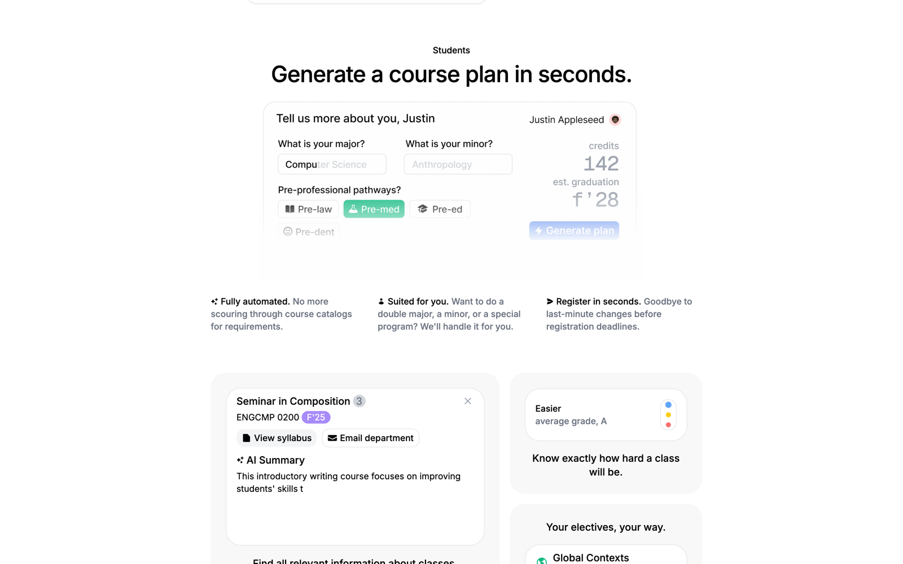
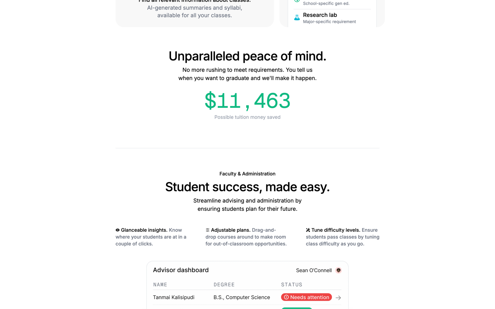

# GradSteps

GradSteps is a degree planner for undergraduates. A student enters a major, a minor,
and a pre-professional track. GradSteps then builds a semester-by-semester plan that
meets every requirement and shows when they will graduate. Advisors see every
student's plan in one dashboard and can tell who is off track.

This repo holds the marketing site at [gradsteps.com](https://gradsteps.com) and
`janitor`, an internal tool for labeling course enrollment rules. The first version
targets the University of Pittsburgh.

Built by [Tanmai Kalisipudi](https://github.com/tanmaik).


## The site

The landing page walks through the product the way a student and an advisor would
use it. Each mock is a live React component animated with Framer Motion, so the
plan, the course cards, and the advisor table move as you scroll.



- **Plan generator.** Pick a major, a minor, and a track like pre-med. The card
  shows total credits and an estimated graduation term.
- **Course cards.** An AI summary of each class, its syllabus, a contact for the
  department, and how hard past students found it.
- **Tuition counter.** A running number for the money a student saves by
  graduating on time.



- **Advisor dashboard.** Every student with a status of on track, check in, or
  needs attention.
- **Cohort metrics.** 4-year graduation and retention rates for the advisor's
  cohort, with a projection.


## janitor

Course catalogs write enrollment rules as free text. `janitor` is a small Next.js
app that builds training data to parse them. It shows one rule at a time. You type
the structured version, or accept the output of the model trained so far. Every 50
or so labels, you fine-tune again, so the model does more of the work each round.

## Stack

Next.js 14 (App Router), React 18, Tailwind CSS, Framer Motion, Geist, and Heroicons.
Deployed on Vercel.

## Run it

```bash
npm install
npm run dev
```

Open http://localhost:3000. The page uses a fixed desktop layout, so view it in a
wide window. No environment variables are needed for the site.
